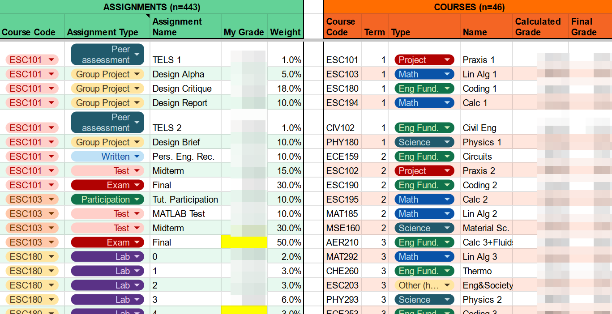

# Analyzing 443 Engineering Assignments

It recently dawned on me that I own an interesting dataset: my grades spreadsheet from my four-year undergrad at the University of Toronto.
Like many students, I kept a record of each assignment, its weight, and my grade
so that when exam time rolled around I knew where I stood and where I should focus my efforts.
This spreadsheet contains 46 classes, 443 assignments and some interesting trends.

This post is exciting to me because it is the first where I've used some fancy software[^2] to make custom plots with interactive buttons! One of my 2024 goals was to "Build an explorable" — a type of website that uses interactive elements to aid comprehension. This post is as close as I'll get to accomplishing that goal[^3].

[^2]:
    Specifically, this website is built with ObservableHQ Framework and uses D3 and ObservableHQ Plot to make
    the plots! All my code is public on [GitHub](https://github.com/staadecker/undergrad-assignments-post)

[^3]: Turns out making custom plots and interactive websites takes A LOT of time, especially since it was my first time. I had grand ambitions to make smooth animations and insightful hover states! You could've explored the data yourself and gawked at the [illuminating transitions](http://vis.berkeley.edu/papers/animated_transitions/)!! But alas... I hope you nonetheless find my far-from-perfect plots fun!

## What types of courses do engineers take?

I categorized all 46 of my courses by their focus:

```js
import { pieChart } from "./components/pieChart.js";

const color_map = {
  "Engineering: Fundamentals": "#42b8f7",
  "Engineering: Energy Systems": "#42f781",
  "Engineering: Projects": "#42f7dc",
  Math: "#f7a942",
  Science: "#f74e42",
  Other: "#7F7F7F",
};
const name_map = {
  "Eng Fund.": "Engineering: Fundamentals",
  Project: "Engineering: Projects",
  "Eng Spec.": "Engineering: Energy Systems",
  "Other (technical)": "Other",
  "Other (humanities)": "Other",
};
let data = await FileAttachment("./data/courses.tsv").tsv({ typed: true });
data = data.map((e) => ({
  ...e,
  type: name_map[e.Type] || e.Type,
  Type: undefined,
}));

let donut_data = Object.entries(
  data.reduce((acc, obj) => {
    const key = obj.type;
    acc[key] = (acc[key] || 0) + 1;
    return acc;
  }, {})
).map(([key, count]) => ({ name: key, value: count }));
donut_data = d3.sort(donut_data, (o) => Object.keys(color_map).indexOf(o.name));
```

```js
pieChart({ data: donut_data, percent: false, width, color_map })
```

As shown, half the courses are engineering-centric courses. A quarter are math or science courses. The remaining quarter fall into the "Other" category and include electives like economics or humanities-like courses I took (rhetoric, ethics, leadership, etc.).

I found the clear-cut distinction between courses to be striking. Of course, there's overlap — engineering courses use math and math courses try to use engineering examples — but nearly all courses have a distinct _focus_. I suppose this is to be expected given the university education model. Professors teach courses in which they have research expertise, so courses must be specific to a topic. Yet, I wonder if this model is best for student learning[^4]. Would an integrated single-course curriculum not give students a richer understanding of their field and the tools to bridge knowledge from one topic to the next?

[^4]: Not that maximizing student learning is the foremost concern of the university's business model.

Below is the breakdown of course types by year (or semester, try the toggle!).

```js
const data_transformed = data.map((row) => {
  const term = row.Term;
  let label = "Y" + Math.floor((term + 1) / 2).toString();
  if (breakdown == "term") {
    if (term % 2 == 0) {
      label += " Spring";
    } else {
      label += " Fall";
    }
  }
  return { ...row, Term: label };
});
```

```js
const breakdown = view(
  Inputs.radio(
    new Map([
      ["Year", "year"],
      ["Semester", "term"],
    ]),
    { label: "Breakdown by: ", value: "year" }
  )
)
```

```js
Plot.plot({
  color: {
    legend: true,
    type: "categorical",
    range: Object.values(color_map),
    domain: Object.keys(color_map),
  },
  x: { type: "band", label: null },
  y: {
    label: "Number of courses",
    domain: [0, breakdown == "term" ? 6 : 12],
    interval: 1,
    tickFormat: ".0f",
  },
  marks: [
    Plot.barY(data_transformed, {
      ...Plot.groupX({ y: "count" }, { x: "Term", fill: "type", tip: true }),
      order: Object.keys(color_map),
    }),
    Plot.ruleY([0]),
  ],
})
```

As shown, my Engineering Science program had a unique '2+2' structure. The first two years are heavy in math, science, and fundamental engineering courses. The last two years students specialize in a major (I chose Energy Systems Engineering) and get to take more electives. I found that spending two years on fundamentals was incredibly valuable. Most engineering programs jump into their specialization after just one year.

## What types of assignments do engineers do?

I gave all 443 assignments a label describing their type, from exams and tests to problem sets and labs.

```js
const detailed_data = (
  await FileAttachment("./data/data_detailed.tsv").tsv({ typed: true })
).map((e) => {
  return { ...e, type: name_map[e.Type] || e.Type, Type: undefined };
});

const total = weighted ? d3.sum(detailed_data, (o) => o.weight) : 1;
const threshold = weighted ? 0.03 : 15;

// Group by `a_type` and compute proportions
const groupedData = Array.from(
  d3.rollup(
    detailed_data,
    (v) => d3.sum(v, (d) => (weighted ? d.weight : 1)) / total,
    (d) => d.a_type
  ),
  ([name, value]) => ({ name, value })
);

// Map small values to "Other"
const aggregatedData = Array.from(
  d3.rollup(
    groupedData,
    (v) => d3.sum(v, (d) => d.value),
    (d) => (d.value >= threshold ? d.name : "Other")
  ),
  ([name, value]) => ({ name, value })
);
```

```js
pieChart({ data: aggregatedData, percent: weighted, width, color_map })
```

At first, it seems that there's a pretty even mix across all assignment types. To think that I wrote
84 quizzes and 72 problem sets is a bit scary! But now try checking the box below to see which assignments
most contributed to my grade.

```js
const weighted = view(
  Inputs.toggle({ label: "Adjust for assignments' weight" })
)
```

Aha, over half of my grade was determined by my exam and test marks only. All those quizzes and problem sets made up less than 10% of my grade!

There's often debate about how many assignments should involve group work or how much final exams should count for. In my biased opinion, I'd say the current mix is about right, except that I think more than just 9% of one's grade should come from written assignments. I don't think engineers get enough training in how to write well.

# How do assignments differ by course type?

Finally, I wanted to know if certain assignment types (say group projects) were being used overwhelmingly in one type of course. The plot below shows what types of assignments make up the grades in each course type.

```js
Plot.plot({
  color: { legend: true, scheme: "Observable10" },
  y: { type: "band", label: "Course type" },
  x: { label: "Grade composition", tickFormat: "%" },
  marks: [
    Plot.barX(
      detailed_data,
      Plot.groupY(
        { x: "sum" },
        {
          y: "c_type",
          fill: "a_type",
          tip: true,
          offset: "normalize",
          x: "weight",
        }
      )
    ),
    Plot.ruleX([0]),
  ],
  marginLeft: 100,
})
```

As shown, group projects and written assignments make up a significant part of the grade in humanities-like and engineering project centric courses, but virtually no others. Is it that engineering and math courses especially do not lend themselves well to group work and writing? Or is it perhaps that grading group projects and essays is more time consuming and hence avoided when possible?

## Final thoughts

There's a lot more I would've liked to discuss, including insights on how _I_ perform rather than just what types of assignments and courses engineering students take. (Spoiler: I did best on problem sets, labs, and fundamental engineering courses while I did worst on exams, tests, group projects, and humanities-like courses, although maybe that is just because the grading one the later is stiffer?)

There is also the sought-after question of how big is the curve? Unfortunately, professors rarely share the final exam grades (or sometimes include the curve directly in the exam grade) so it is often impossible to answer the question precisely. Still, in the 11 courses where I could make an estimate, my final grade was 0 to 12% higher than expected due to the curve[^5] (median of 2%).

[^5]: The 12% curve was in Prof. Davis' infamous Calculus 1!

## Appendix: Methodology

I dream of the day where my data will be orderly, clean and free of inconsistencies or edge cases.
Unfortunately, I have not experienced such a day. I spent several hours transcribing all my data into the two neat tables shown below.



From there, I analyzed my data mostly in Google Sheets before creating my desired plots in an ObservableHQ Notebook using D3 and Observable Plot. Maybe some day I'll try out Vega and Vega-lite too!